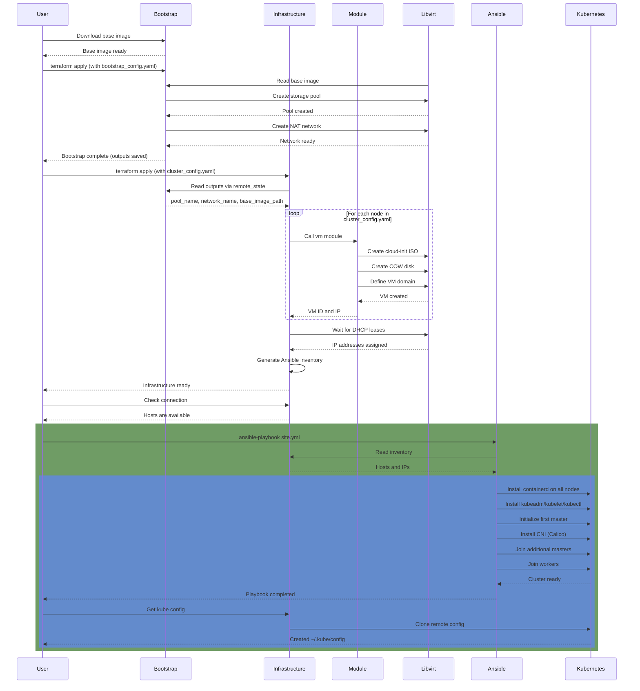

# Local homelab

- ✔ Hypervisor ✔
  - [KVM/libvirt](/docs/Virtualization.md)
- ✔ IaC ✔
  - Terraform
    - Providers
      - dmacvicar/libvirt
      - hashicorp/local
- ✔ Configuration management ✔
  - Ansible
- CI/CD
  - Gitlab CI
  - ArgoCD
- Secrets
  - Hashicorp Vault
- Ingress
  - NGINX Ingress
- ✔ Orchestration ✔
  - Kubernetes
    - kubeadm
    - HAProxy
    - Calico
- Database
  - PostgreSQL
- Monitoring
  - Prometheus
  - Grafana
- Logging
  - Loki/ELK

## Infrastructure as code

Bootstrap configuration is defined in [bootstrap/bootstrap-config.yaml](bootstrap/bootstrap-config.yaml):

- Base image
- Storage pool
- Network

Infrastructure configuration is defined in [infrastructure/cluster-config.yaml](infrastructure/cluster-config.yaml):

- VM nodes
- Defaults
- Local ssh keys

### Helper scripts

[bootstrap/scripts](bootstrap/scripts):

- download-image.sh - wgets current ubuntu 24 and places it close to virt pool

[infrastructure/scripts](infrastructure/scripts)

- check-conn.sh - runs after VMs is created and checks ssh connectivity
- get-kubeconfig.sh - runs after k8s is configured, clones `~/.kube/config` locally

## Configuration Management

Ansible configuration of deployed servers is is located at [infrastructure/ansible](infrastructure/ansible)

## Sequence diagram example

Example diagram how infrastructure and kubernetes cluster are deployed.
All user inputs automated with [Makefile](Makefile)
Run `make help` to see all the commands.

